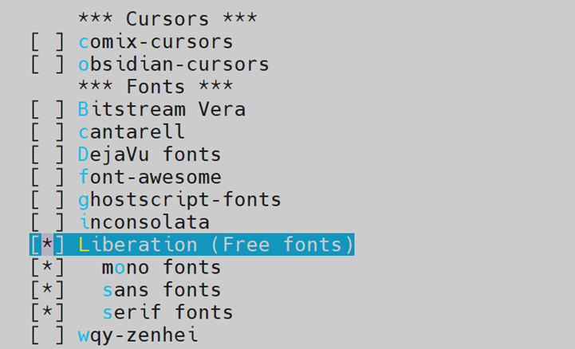
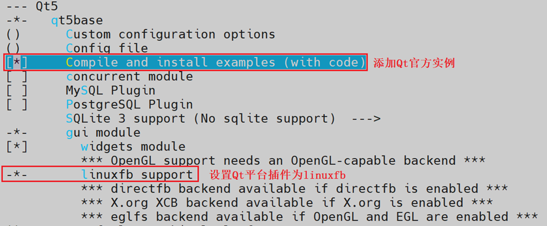
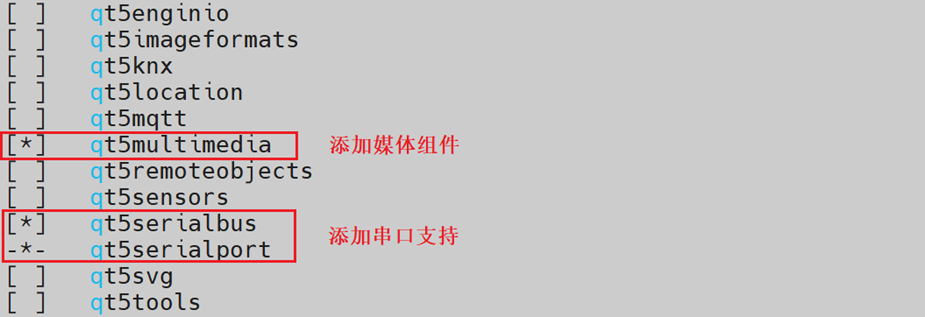

# K230 Qt移植指南


版权所有©2023北京嘉楠捷思信息技术有限公司

<div style="page-break-after:always"></div>

## 免责声明

您购买的产品、服务或特性等应受北京嘉楠捷思信息技术有限公司（“本公司”，下同）及其关联公司的商业合同和条款的约束，本文档中描述的全部或部分产品、服务或特性可能不在您的购买或使用范围之内。除非合同另有约定，本公司不对本文档的任何陈述、信息、内容的正确性、可靠性、完整性、适销性、符合特定目的和不侵权提供任何明示或默示的声明或保证。除非另有约定，本文档仅作为使用指导参考。

由于产品版本升级或其他原因，本文档内容将可能在未经任何通知的情况下，不定期进行更新或修改。

## 商标声明

、“嘉楠”和其他嘉楠商标均为北京嘉楠捷思信息技术有限公司及其关联公司的商标。本文档可能提及的其他所有商标或注册商标，由各自的所有人拥有。

**版权所有 © 2023北京嘉楠捷思信息技术有限公司。保留一切权利。**
非经本公司书面许可，任何单位和个人不得擅自摘抄、复制本文档内容的部分或全部，并不得以任何形式传播。

<div style="page-break-after:always"></div>

## 目录

[TOC]

## 前言

### 概述

本文档主要介绍Qt GUI环境移植

### 读者对象

本文档（本指南）主要适用于以下人员：

- 技术支持工程师
- 软件开发工程师

### 修订记录

| 文档版本号 | 修改说明 | 修改者 | 日期 |
| --- | --- | --- | --- |
| V1.0 | 初版 | 王权 | 2023/11/29 |

## 1. Qt简介

Qt是一个跨平台的C++图形用户界面应用程序开发框架。它既可以开发GUI程序，也可用于开发非GUI程序，比如控制台工具和服务器。Qt是面向对象的框架，并且很容易进行扩展，允许真正地组件编程

### 1.1 Qt GUI特点

1. 优良的跨平台特性，支持Windows、Linux、FreeBSD

1. 使用面向对象机制

1. 丰富的组件支持，Qt包含250个以上的C++类

## 2. Qt移植说明

本文主要介绍如何通过buildroot添加Qt 5.15支持

### 2.1 进入buildroot配置界面

k230_sdk主目录下，运行如下命令：

```sh

make buildroot-menuconfig

```

### 2.2 添加字库支持

点击Target packages --> Fonts, cursors, icons, sounds and themes

下图所示为字库配置界面：



尽量选择免费字库，减少后续的版权纠纷

### 2.3 添加Qt 5组件

点击Target packages --> Graphic libraries and applications (graphic/text) --> Qt 5，选择如下配置选项：

下图所示为Qt配置界面：






### 2.4 保存buildroot配置信息

k230_sdk主目录下，运行如下命令：

```sh

make buildroot-savedefconfig

```

### 2.5 查看buildroot配置选项

字库和Qt添加成功后，buildroot配置文件如下所示：

```sh

BR2_PACKAGE_QT5=y
BR2_PACKAGE_QT5BASE_EXAMPLES=y
BR2_PACKAGE_QT5BASE_WIDGETS=y
BR2_PACKAGE_QT5BASE_FONTCONFIG=y
BR2_PACKAGE_QT5BASE_HARFBUZZ=y
BR2_PACKAGE_QT5BASE_GIF=y
BR2_PACKAGE_QT5BASE_JPEG=y
BR2_PACKAGE_QT5BASE_PNG=y
BR2_PACKAGE_QT5BASE_TSLIB=y
BR2_PACKAGE_QT5MULTIMEDIA=y
BR2_PACKAGE_QT5SERIALBUS=y
BR2_PACKAGE_QJSON=y

```

## 3. 添加环境变量和JSON配置文件

### 3.1 添加Qt环境变量

```c

export QT_QPA_FB_DRM=1
export QT_QPA_EGLFS_KMS_ATOMIC=1
export QT_QPA_EGLFS_KMS_CONFIG=/etc/qt_config.json
export QT_QPA_FONTDIR=/usr/share/fonts
export QT_QPA_PLATFORM=linuxfb:rotation=0
export QT_ROOT=/usr/lib/qt
export QT_QPA_PLATFORM_PLUGIN_PATH=$QT_ROOT/plugins
export QT_QPA_GENERIC_PLUGINS="tslib:/dev/input/event0"
export XDG_RUNTIME_DIR=/tmp
export RUNLEVEL=3
export QT_DEBUG_PLUGINS=1
export QT_LOGGING_RULES="qt.qpa.*=true"

```

将上述环境变量保存到开发板文件系统/etc/profile文件中，使得环境变量可以开机生效

下图所示为相关环境变量解释：

1. QT_QPA_FB_DRM=1：由于Framebuffer驱动已经被Linux内核废弃，因此绝大部分SOC芯片的显示驱动都使用DRM架构，设置QT_QPA_FB_DRM环境变量为1，表示Qt使用DRM驱动以及libdrm库

1. QT_QPA_EGLFS_KMS_ATOMIC=1：表示使用DRM驱动的atomic API，而不是默认的legacy API

1. QT_QPA_EGLFS_KMS_CONFIG=/etc/qt_config.json：设置JSON配置文件的绝对路径

1. QT_QPA_FONTDIR=/usr/share/fonts：设置字库的绝对路径

1. QT_DEBUG_PLUGINS=1：表示Qt在加载插件时，输出调试信息，这样可以方便地知道Qt加载了哪些插件，哪些插件加载成功，哪些插件加载失败，插件加载失败的原因是什么等等非常多的调试信息。

1. QT_LOGGING_RULES="qt.qpa.*=true"：打开Qt图形和输入子系统的日志记录

### 3.2 添加JSON配置文件

```c

{
  "device": "/dev/dri/card0",
  "outputs": [
    { "name": "DSI1", "mode": "1080x1920", "size": "1080x1920", "format": "rgb565", "physicalWidth": 68, "physicalHeight": 120}
  ]
}

```

需要特别注意以下字段：

name：显示屏通过DSI1进行连接，类似的连接参数还有：HDMI1、DP1、VGA1、LVDS1，请根据实际情况进行选择

format：设置Qt显示缓冲区的颜色空间，这个需要通过查询DRM显示控制器的图层参数获得

physicalWidth和physicalHeight：设置显示屏的物理尺寸，单位为毫米
