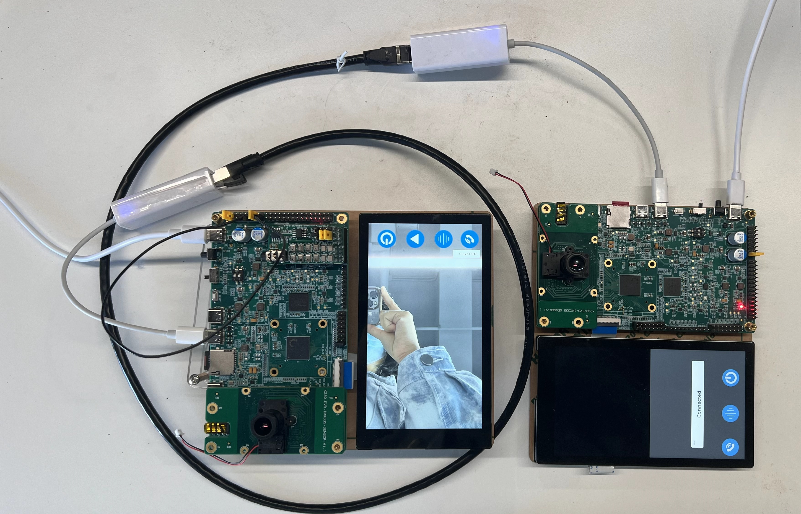

# K230 场景实战-猫眼POC

版权所有©2023北京嘉楠捷思信息技术有限公司

## 免责声明

您购买的产品、服务或特性等应受北京嘉楠捷思信息技术有限公司（“本公司”，下同）及其关联公司的商业合同和条款的约束，本文档中描述的全部或部分产品、服务或特性可能不在您的购买或使用范围之内。除非合同另有约定，本公司不对本文档的任何陈述、信息、内容的正确性、可靠性、完整性、适销性、符合特定目的和不侵权提供任何明示或默示的声明或保证。除非另有约定，本文档仅作为使用指导参考。

由于产品版本升级或其他原因，本文档内容将可能在未经任何通知的情况下，不定期进行更新或修改。

## 商标声明

、“嘉楠”和其他嘉楠商标均为北京嘉楠捷思信息技术有限公司及其关联公司的商标。本文档可能提及的其他所有商标或注册商标，由各自的所有人拥有。

**版权所有 © 2023北京嘉楠捷思信息技术有限公司。保留一切权利。**
非经本公司书面许可，任何单位和个人不得擅自摘抄、复制本文档内容的部分或全部，并不得以任何形式传播。

## K230 猫眼

在K230平台开发的一套集成UI、视频对讲、人形检测功能的产品级程序。猫眼产品支持远程猫眼和本地猫眼两种，本文档暂时只描述远程猫眼，所谓远程猫眼即猫眼设备可以与远程手机设备进行交互。

### 硬件环境

- K230-USIP-LP3-EVB-V1.0/K230-USIP-LP3-EVB-V1.1 * 2个
- 配套的LCD模组 * 2个
- K230-USIP-IMX335-SENSOR-V1.1模组 * 2个
- typeC转网口接口 * 2个
- 外置音频子板一块
- 网线一根

除外置音频子板和网线外，远程猫眼需要两套设备，一套作为猫眼设备，一套模拟手机设备。音频子板用于猫眼设备端。

上图中左面的evb板运行猫眼设备端，右面的evb板运行模拟手机端。
界面UI上的按键功能如下：

- 对讲键：控制对讲的开始/取消。
- 变声键：控制变声的使能/取消。
- 播放键：进去回放界面，回放录制的视频或抓拍的图片。
- 关机键：控制猫眼设备端关机。

## 概述

猫眼程序作为一个POC项目，提供给客户如何使用lvgl、大小核通信、网络通信、多媒体pipeline及ai等功能的参考。

程序的主要功能：

1. 模拟两种唤醒模式：PIR唤醒和门铃唤醒。

   - PIR唤醒：
     - 猫眼设备端进行人形检测并抓拍存盘。
   - 门铃唤醒：
     - 可进行远程可视对讲，本地语音对讲，存盘及回放。

1. rtsp网络服务以及rpc服务。
1. 大小核事件、数据通信。
1. 图像抓拍、录像以及回放。
1. GUI显示。

程序主要两大部分：

- 猫眼设备侧程序：包括大核程序和小核程序两个
  1. 大核程序
  主要完成ai人形检测、视频输入、视频/图像编码、音频输入及编码、音频解码及输出功能。
  1. 小核程序
  主要完成UI界面控制、音视频的推流、存盘、回放、与手机设备交互实现视频对讲功能，以及本地语音对讲功能。

- 手机设备侧程序：只包括小核程序
  小核侧程序主要完成通过UI界面控制视频对讲的开始、结束、变声功能，和猫眼设备交互实现视频对讲功能。

## 功能演示

### 门铃模式

猫眼设备
通过长按按键的方式启动，启动UI界面，按键功能如下：

- 对讲键：对讲使能/取消，仅用于本地门铃对讲。程序运行起来第一次按下后，对讲开始。
- 变声键:控制变声使能/取消，仅用于本地门铃对讲，默认不变声。
- 播放键：按键为回放，用于播放本地存储的视频和图像。(注意本地对讲时，需要先取消对讲再进行回放)
- 关机键：控制设备关机。

对讲按钮上方显示的为本地IP地址。

当门铃唤醒猫眼设备后，屏幕显示本地摄像头采集的视频，可以通过两种方式进行视频对讲。一种为本地门铃语音对讲，另外一种为远程门铃可视对讲。

#### 本地门铃语音对讲

点击猫眼设备端的对讲按键，开始门内外对讲。将耳机连接到猫眼设备的evb板载耳机接口和子板耳机接口，可以听到对端声音。

#### 远程门铃可视对讲

远程对讲，需要另外一块开发板运行手机端程序。当与设备端连接上之后，手机端会弹框显示"Connected"，随后弹框消失，继续显示主界面。下方的三个按键功能：

- 对讲键：控制对讲使能/取消，程序运行起来后，会出现唤醒模式的弹框。此后通过此按键触发对讲，第一次按下后，对讲开始。
- 变声键：控制变声使能/取消，默认不变声。
- 关机键：远程控制猫眼设备端关机。

## 限制条件及说明

1. 目前仅支持网络直连测试，手机端和设备端均配置了静态IP。
1. 远程可视对讲挂断后，不支持再次连接。
1. 回放结束后，不支持远程可视对讲。
1. 门铃模式开机后开始存盘，存储格式为mp4。再次通过门铃模式开始，会覆盖上一次的存盘。
1. PIR模式检测人形之后的抓拍图像，需要通过门铃模式唤醒后，点击回放按键查看。
1. 目前配置的存储空间为256MB。

## 源码位置

- 猫眼设备大核程序源码路径位于`k230_sdk/src/reference/business_poc/peephole/big`
- 猫眼设备小核程序源码路径位于 `k230_sdk/src/reference/business_poc/peephole/peephole_device`
- 模拟手机设备程序源码路径位于`k230_sdk/src/reference/business_poc/peephole/peephole_phone`

## 编译程序

### 猫眼设备

猫眼设备端需要用猫眼设备配置脚本进行编译，编译命令为`make CONF=k230_evb_peephole_device_defconfig`。
**需要注意，配置过CONF后，后面的编译命令即使不配置CONF，也会用上一次的CONF进行编译，编译产物在`k230_sdk/output/${CONF}`目录下**
默认的CONF为`k230_evb_defconfig`。
生成的镜像在`output/k230_evb_peephole_device_defconfig/images/sysimage-sdcard.img.gz`，烧录该镜像，启动后自动运行猫眼设备端。

### 模拟手机设备

可以通过`make CONF=k230_evb_peephole_phone_defconfig`编译生成手机端镜像，生成的镜像在`output/k230_evb_peephole_phone_defconfig/images/sysimage-sdcard.img.gz`，烧录该镜像，启动后自动运行模拟手机端程序。

## 运行程序

### 运行猫眼设备端程序

猫眼设备端如下图所示，可以通过两种方式启动。

- 方式一：将拨码开关拨到`ON`，此方式模拟PIR唤醒。
  - 设备会进行首帧抓拍，人形检测，检测到人形10秒后抓拍。本文中所指人形检测为整个人形。
  - 此模式启动后，可以通过短按门铃按键进入门铃模式。
- 方式二：长按按键，此方式模拟门铃唤醒。
  - evb板上的mic和耳机，模拟门外场景；音频子板上的mic和耳机模拟门内场景。

猫眼镜像为自启动模式，烧录猫眼镜像后，需要分别将J1的1、2引脚，13、14引脚，9、15引脚两两短接，如下图所示。

### 运行模拟手机端

烧录模拟手机端镜像后，启动后自动运行手机端程序。待弹框提示连上成功之后，可以通过按键控制与猫眼设备端交互。
